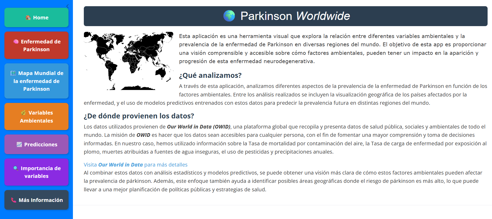

# Minería de datos y aprendizaje automático aplicado a la predicción de incidencia de párkinson basado en la biometereología.
**Autor:** Lorena Calvo Pérez  
**Tutores:** Antonio Jesus Canepa Oneto, Esther Cubo Delgado  
**Universidad:** Universidad de Burgos  
**Titulación:** Grado en Ingeniería de la Salud  
**Curso académico:** 2024/2025  

---
## Introducción

La enfermedad de Parkinson (EP) es un **trastorno neurodegenerativo del sistema nervioso central (SNC)** que afecta a más de 10 millones de personas en todo el mundo, siendo la segunda más común tras el Alzheimer. Su prevalencia ha aumentado significativamente en los últimos años, especialmente en países con una población envejecida, y se estima que el número de casos se duplicará para 2050.

Aunque su causa exacta sigue siendo desconocida, la EP es considerada una enfermedad multifactorial, influenciada por factores genéticos, ambientales y otros. Diversos estudios han demostrado que ciertas variables ambientales pueden afectar tanto al desarrollo como a la progresión de la enfermedad.

En este contexto, la **biometeorología**, que estudia cómo el clima y el entorno influyen en la salud humana, está adquiriendo una relevancia creciente. Este proyecto utiliza técnicas de **minería de datos** y **aprendizaje automático** para analizar el impacto de variables ambientales en la enfermedad de Parkinson, con el objetivo de desarrollar modelos predictivos que ayuden a entender mejor estos factores.

## Objetivo principal

Desarrollar un sistema basado en **minería de datos** y **aprendizaje automático** para analizar y predecir la prevalencia de la enfermedad de Parkinson a partir de variables **biometeorológicas**, con el fin de identificar factores ambientales que puedan influir en su desarrollo.

## Resultados

Los resultados del análisis y los modelos predictivos desarrollados se encuentran disponibles a través de la siguiente aplicación web:

🔗 [Acceder a la aplicación](https://lorenacalvoperez-parkinson-worldwide.share.connect.posit.cloud/)

A continuación, se muestra una captura de pantalla de la interfaz:

